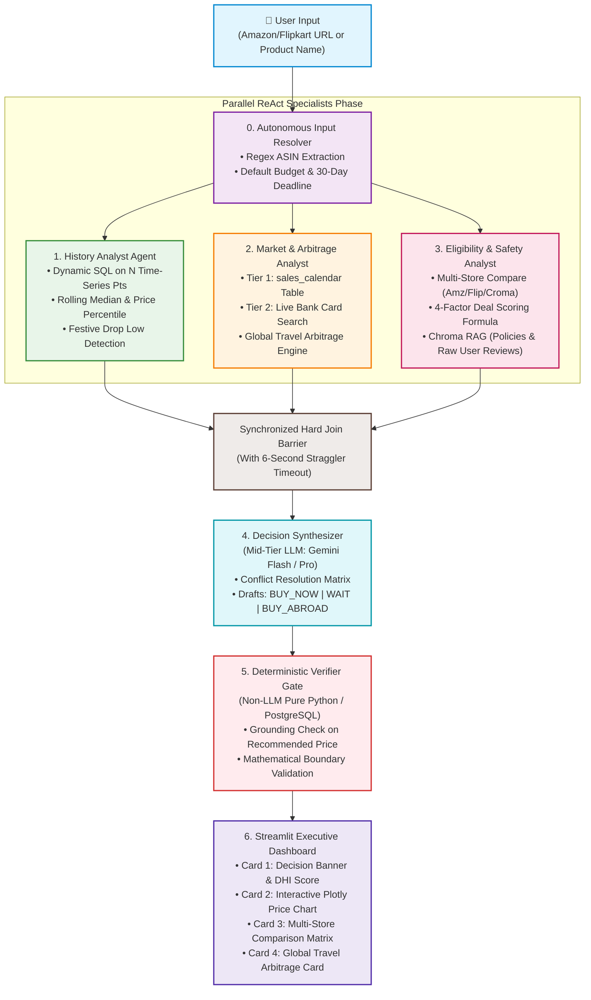

# PriceLens — System Architecture & 5-Day Implementation Plan

**Project:** Autonomous Purchase-Timing, Deal Intelligence & Global Arbitrage Advisor  
**Engineering Horizon:** **5 Days (120 Hours)**  
**Scope:** Top 100 Flagship Electronics (Laptops, Smartphones, Tablets, Audio, Consoles)  
**Core Stack:** Python 3.11+ | PostgreSQL (Dynamic Time-Series) | Chroma DB (Policy RAG) | LangGraph (DAG) | Streamlit (UI)

---

## 1. System Architecture & End-to-End Information Flow

### 1.1 Architecture Mermaid Diagram



---

### 1.2 Execution Topology (ASCII Reference)

```
                      [ User Input: Amazon/Flipkart URL or Product Name ]
                                               │
                                               ▼
                                 [ Autonomous Input Resolver ]
                     (Extracts ASIN/SKU, applies default budget & deadline)
                                               │
                                               ▼
                              [ LangGraph Shared State Dispatch ]
                                               │
             ┌─────────────────────────────────┼─────────────────────────────────┐
             ▼                                 ▼                                 ▼
      History Analyst             Market & Arbitrage Analyst            Eligibility & Safety
       (Agent 1)                             (Agent 2)                        (Agent 3)
  • PostgreSQL Dynamic SQL on      • Tier 1: `sales_calendar` Lookup • Live Offer Multi-Store
    variable time-series (N pts)     (Days until next BBD/GIF sale)    Deal Scoring Formula
  • Median, Percentile, Drop %     • Tier 2: Dynamic Search Tool     • Policy & Warranty
  • Festive Drop Low Detection       (Active HDFC/ICICI bank promos)   Check (Chroma RAG)
                                   • Competitor Price Search         • Seller Authorization
                                   • Global Arbitrage Engine           and stock verification
             │                                 │                                 │
             └─────────────────────────────────┼─────────────────────────────────┘
                                               ▼
                                     [ Hard Join Barrier ]
                               (With 6-second straggler timeout)
                                               │
                                               ▼
                                   [ Decision Synthesizer ]
                                 (Mid-Tier LLM: Gemini Pro)
                                               │ DraftProposal
                                               ▼
                                 [ Deterministic Verifier Gate ]
                                 (Non-LLM Pure Python/PostgreSQL)
                                               │
                        ┌──────────────────────┴──────────────────────┐
                        ▼ (Passed)                                    ▼ (Failed)
               [ 4-Card UI Output ]                         [ Fallback / Retry ]
          • Decision Badge & Rationale                 • Corrects ungrounded price
          • Multi-Store Comparison                       or switches to Safe Stance
          • Interactive Dynamic Chart
          • Global Arbitrage Travel Card
```

---

## 2. Detailed Agent Roles & Responsibilities Breakdown

```
┌────────────────────────────────────────────────────────────────────────────────────────┐
│ 0. AUTONOMOUS INPUT RESOLVER (Pre-Graph Ingestion Node)                                │
├────────────────────────────────────────────────────────────────────────────────────────┤
│ • Role: Converts messy raw user inputs into structured pipeline parameters.            │
│ • Input: Raw user string (e.g., 'https://amazon.in/dp/B0CS5XW6TN' or 'S24 Ultra').     │
│ • Key Actions:                                                                         │
│   1. Regex extracts 10-character ASIN (`r'/dp/([A-Z0-9]{10})'`) or fuzzy SQL matches.  │
│   2. Sets Default Budget = Current Amazon price (if user omitted budget).              │
│   3. Sets Default Deadline = 30 days (standard e-commerce buying cycle).               │
│ • Output Contract: Standardized `canonical_id`, `product_title`, and budget baseline.  │
└────────────────────────────────────────────────────────────────────────────────────────┘
                                           │
                                           ▼ (Dispatches to 3 Parallel Specialists)
┌────────────────────────────────────────────────────────────────────────────────────────┐
│ 1. HISTORY ANALYST AGENT (The Time-Series Specialist)                                  │
├────────────────────────────────────────────────────────────────────────────────────────┤
│ • Core Question Answered:                                                              │
│   "Is the current price historically cheap, average, or expensive? If the buyer waits, │
│    how much can they realistically expect the price to drop based on past trends?"     │
│ • Data Source: PostgreSQL `price_history` (Handles variable length N points per SKU).  │
│ • Primary Tool: `query_historical_trend(canonical_id)`                                 │
│ • Key Metrics Computed:                                                                │
│   - Available Data Horizon (e.g. 90, 180, 256, or 365+ days).                          │
│   - Price Percentile (0.0 = All-time low, 1.0 = All-time high).                        │
│   - 1-Year Average & 30-Day Moving Median.                                             │
│   - Historical Festive Low (Lowest price during major sale months like Oct Diwali/BBD).│
│ • Output Contract: `HistoryReport`                                                     │
│   { current_price, atl, percentile, festive_low, historical_stance: 'BUY_NOW'|'WAIT' } │
└────────────────────────────────────────────────────────────────────────────────────────┘

┌────────────────────────────────────────────────────────────────────────────────────────┐
│ 2. MARKET & ARBITRAGE ANALYST AGENT (The Timing & External Signals Specialist)         │
├────────────────────────────────────────────────────────────────────────────────────────┤
│ • Core Question Answered:                                                              │
│   "Is a major festive sale or bank offer happening soon? Can the buyer save money by   │
│    traveling to Dubai/US/Singapore and purchasing abroad?"                             │
│ • Data Sources: PostgreSQL `sales_calendar` + Dynamic Web Search (Tavily/DuckDuckGo).  │
│ • Primary Tools:                                                                       │
│   1. `check_upcoming_sales_and_promos`:                                                │
│      - Tier 1: Looks up `sales_calendar` for days until next sale (e.g. BBD in 18 days). │
│      - Tier 2: Searches web for active HDFC/ICICI/SBI instant credit card discounts.   │
│   2. `evaluate_global_arbitrage`:                                                      │
│      - Scans official retail prices in USA, UAE, Japan, Singapore.                     │
│      - Applies live forex rate + estimated flight/visa travel buffer.                  │
│      - Flags net savings if traveling & buying abroad saves > ₹12,000.                 │
│ • Output Contract: `MarketArbitrageReport`                                             │
│   { upcoming_sale, days_away, active_bank_offers, global_arbitrage_deal }              │
└────────────────────────────────────────────────────────────────────────────────────────┘

┌────────────────────────────────────────────────────────────────────────────────────────┐
│ 3. ELIGIBILITY & SAFETY ANALYST AGENT (The Store & Risk Specialist)                    │
├────────────────────────────────────────────────────────────────────────────────────────┤
│ • Core Question Answered:                                                              │
│   "Which domestic store (Amazon vs Flipkart vs Croma) offers the safest and best value │
│    deal right now? What are the return, warranty, and seller risks?"                   │
│ • Data Sources: PostgreSQL `live_store_offers` + Chroma Vector DB (`retailer_policies` & `raw_user_reviews`).│
│ • Primary Tools:                                                                       │
│   1. `fetch_competitor_pricing`: Compares live prices across Amazon, Flipkart, Croma. │
│   2. `calculate_deal_score`: Deterministic 4-factor formula:                           │
│      Score = (0.40 * Price) + (0.30 * Seller) + (0.20 * Warranty) + (0.10 * Delivery).│
│   3. `check_policy_and_risks`: Queries Chroma for return rules (e.g., replacement only │
│      on phones) and performs Deep Semantic RAG on thousands of chunked raw user        │
│      reviews to detect hidden defects (e.g., "green line issue", "heating").           │
│ • Output Contract: `EligibilityReport`                                                 │
│   { cheapest_store, safest_store, deal_score, warranty_valid, return_policy_warning }   │
└────────────────────────────────────────────────────────────────────────────────────────┘
                                           │
                                           ▼ (Synchronized at Join Barrier)
┌────────────────────────────────────────────────────────────────────────────────────────┐
│ 4. DECISION SYNTHESIZER (The Central Arbiter — Gemini Flash / Pro)                     │
├────────────────────────────────────────────────────────────────────────────────────────┤
│ • Role: Reconciles reports from the 3 specialists using the Conflict Resolution Matrix.│
│ • Actions:                                                                             │
│   - Weighs immediate bank discounts vs. waiting for an upcoming festive drop.          │
│   - Disqualifies unverified/unsafe 3P sellers even if they are the cheapest.           │
│   - Formulates the final recommendation badge (`BUY_NOW`, `WAIT`, `BUY_ABROAD`).       │
│ • Output: `DraftVerdictProposal` (Subject to non-LLM verification).                    │
└────────────────────────────────────────────────────────────────────────────────────────┘
                                           │
                                           ▼
┌────────────────────────────────────────────────────────────────────────────────────────┐
│ 5. DETERMINISTIC VERIFIER GATE (Pure Python / PostgreSQL Guardrail)                    │
├────────────────────────────────────────────────────────────────────────────────────────┤
│ • Role: Zero-hallucination validation before the user sees the output.                 │
│ • Actions:                                                                             │
│   - Verifies recommended store and price directly in PostgreSQL tables.                │
│   - For `WAIT`: Ensures target price is mathematically grounded against historical min.│
│   - For `BUY_NOW`: Ensures target price matches active store offer or net promo price. │
│ • Output: Validated JSON payload emitted to the Streamlit UI.                          │
└────────────────────────────────────────────────────────────────────────────────────────┘
```

---

## 3. The 5-Day Master Execution Schedule

```
[ DAY 1: STORAGE & INGESTION ]
• PostgreSQL schema setup & seed sales_calendar.
• batch_runner.py caches Apify & PriceHistoryApp into PostgreSQL.
• Initialize ChromaDB (for policies and raw user reviews).

[ DAY 2: DETERMINISTIC TOOLS & METRICS ]
• Tool 1: query_historical_trend (PostgreSQL dynamic N-point time-series).
• Tool 2: calculate_deal_health_index (Deterministic 0–100 DHI).
• Tool 3: check_upcoming_sales_and_promos (sales_calendar + web search).
• Tool 4: evaluate_global_arbitrage (Forex + flight cost buffer).

[ DAY 3: LANGGRAPH DAG & DEEP SEMANTIC RAG ]
• Embed retailer warranty/return policies into Chroma DB.
• Chunk and embed thousands of raw user reviews into Chroma DB for Deep Semantic RAG.
• StateGraph with safe concurrent reducers.
• Implement 3 parallel agent nodes + Decision Synthesizer.
• Deterministic Verifier Gate (pure Python/PostgreSQL).

[ DAY 4: STREAMLIT UI DASHBOARD ]
• Card 1: Decision Banner (🟢 BUY NOW / 🟡 WAIT / ✈️ BUY ABROAD).
• Card 2: Interactive Plotly historical price chart.
• Card 3: Multi-Store Comparison Matrix (Amazon vs Flipkart vs Croma).
• Card 4: Global Travel Arbitrage Card & Warranty Shield.

[ DAY 5: BENCHMARK EVALUATION & CAPSTONE DEFENSE PREP ]
• Run automated 20-product benchmark test suite (100% Grounding target).
• Record 3-minute video walkthrough (S24 Ultra & iPhone 15 Pro).
• Final Capstone report with architecture diagrams.
```

---

## 4. PostgreSQL Database Schema (`pricelens`)

```sql
-- 1. Master Product Catalog
CREATE TABLE IF NOT EXISTS products (
    canonical_id VARCHAR(50) PRIMARY KEY,       -- ASIN (e.g. 'B0CS5XW6TN')
    title TEXT NOT NULL,
    brand VARCHAR(100),
    model VARCHAR(100),
    color VARCHAR(50),
    storage VARCHAR(50),
    ram VARCHAR(50),
    image_url TEXT,
    list_price DOUBLE PRECISION,
    current_price DOUBLE PRECISION,
    all_time_low DOUBLE PRECISION,
    all_time_high DOUBLE PRECISION,
    avg_30_days DOUBLE PRECISION,
    overall_avg DOUBLE PRECISION,
    customer_rating DOUBLE PRECISION,
    review_count INTEGER,
    in_stock BOOLEAN DEFAULT TRUE,
    seller_name VARCHAR(150),
    warranty_description TEXT,
    ai_reviews_summary TEXT,
    created_at TIMESTAMPTZ DEFAULT CURRENT_TIMESTAMP
);

-- 2. Dynamic Price History (N points per product)
CREATE TABLE IF NOT EXISTS price_history (
    id BIGSERIAL PRIMARY KEY,
    canonical_id VARCHAR(50) NOT NULL REFERENCES products(canonical_id) ON DELETE CASCADE,
    recorded_date DATE NOT NULL,
    price DOUBLE PRECISION NOT NULL,
    CONSTRAINT unique_product_date UNIQUE(canonical_id, recorded_date)
);
CREATE INDEX IF NOT EXISTS idx_history_date ON price_history(canonical_id, recorded_date DESC);

-- 3. Competitor Live Offers (Flipkart, Amazon, Croma)
CREATE TABLE IF NOT EXISTS live_store_offers (
    offer_id BIGSERIAL PRIMARY KEY,
    canonical_id VARCHAR(50) NOT NULL REFERENCES products(canonical_id) ON DELETE CASCADE,
    retailer VARCHAR(100) NOT NULL,             -- 'Amazon', 'Flipkart', 'Croma'
    price DOUBLE PRECISION NOT NULL,
    product_url TEXT NOT NULL,
    is_current BOOLEAN DEFAULT FALSE,
    fetched_at TIMESTAMPTZ DEFAULT CURRENT_TIMESTAMP
);

-- 4. Annual E-Commerce Sales Calendar
CREATE TABLE IF NOT EXISTS sales_calendar (
    sale_id SERIAL PRIMARY KEY,
    sale_name VARCHAR(150) NOT NULL,
    retailer VARCHAR(150) NOT NULL,
    approx_start_date DATE NOT NULL,
    approx_end_date DATE NOT NULL,
    typical_category_discount_pct DOUBLE PRECISION,
    sale_type VARCHAR(50)
);

INSERT INTO sales_calendar (sale_name, retailer, approx_start_date, approx_end_date, typical_category_discount_pct, sale_type) VALUES
('Big Billion Days & Great Indian Festival', 'Amazon & Flipkart', '2026-10-06', '2026-10-15', 0.18, 'MAJOR_FESTIVE'),
('Republic Day Sale', 'Amazon & Flipkart', '2027-01-19', '2027-01-26', 0.10, 'MAJOR_FESTIVE'),
('Amazon Prime Day', 'Amazon', '2027-07-15', '2027-07-17', 0.12, 'SEASONAL')
ON CONFLICT DO NOTHING;
```

---

## 5. Deterministic Deal Health Index (DHI)

$$\text{DHI} = (0.40 \times S_{\text{history}}) + (0.25 \times S_{\text{competitor}}) + (0.20 \times S_{\text{rating}}) + (0.15 \times S_{\text{sentiment}})$$

* **$S_{\text{history}}$:** $100 \times \left(1 - \frac{\text{Current} - \text{ATL}}{\text{ATH} - \text{ATL}}\right)$
* **$S_{\text{competitor}}$:** $100$ if cheapest across Amazon, Flipkart, Croma; penalized if another store is cheaper.
* **$S_{\text{rating}}$:** $(\text{Stars} / 5.0) \times 100$.
* **$S_{\text{sentiment}}$:** $-20$ points penalty if complaints cite overheating or battery issues in reviews.
* **Output Tiers:**
  - $80 - 100$: 🔥 *Steal Deal*
  - $65 - 79$: 🟢 *Good Deal*
  - $45 - 64$: 🟡 *Fair Deal*
  - $< 45$: 🔴 *Overpriced*

---

## 6. Deterministic Verifier Gate (Non-LLM Guardrail)

```python
def verifier_gate(proposal: dict, db_conn) -> tuple[bool, str]:
    canonical_id = proposal["canonical_id"]
    decision = proposal["decision"] # "BUY_NOW" | "WAIT"
    target_price = proposal["target_price"]
    
    with db_conn.cursor() as cur:
        # Check 1: Minimum 30 Days History Check
        cur.execute("SELECT COUNT(*) FROM price_history WHERE canonical_id = %s", (canonical_id,))
        count = cur.fetchone()[0]
        if count < 30:
            if decision != "REFUSE_NO_HISTORY":
                return False, "Reject: Less than 30 days of data, agent must issue REFUSE_NO_HISTORY"
            return True, "Verified Refusal"

        # Check 2A: BUY_NOW Grounding
        if decision == "BUY_NOW":
            cur.execute(
                "SELECT price FROM live_store_offers WHERE canonical_id = %s AND retailer = %s",
                (canonical_id, proposal["recommended_retailer"])
            )
            row = cur.fetchone()
            if not row:
                return False, f"Recommended retailer {proposal['recommended_retailer']} has no verified offer."
            db_price = row[0]
            bank_discount = proposal.get("verified_bank_discount", 0.0)
            expected = db_price - bank_discount
            if abs(target_price - expected) > 10.0:
                return False, f"BUY_NOW price ₹{target_price} ungrounded (DB expected: ₹{expected})"
                
        # Check 2B: WAIT Boundary Grounding
        elif decision == "WAIT":
            cur.execute("SELECT MIN(price), AVG(price) FROM price_history WHERE canonical_id = %s", (canonical_id,))
            atl, avg_p = cur.fetchone()
            if target_price >= avg_p:
                return False, f"WAIT target price ₹{target_price} must be lower than overall average ₹{avg_p}"
            if target_price < (atl * 0.85):
                return False, f"WAIT target price ₹{target_price} is unrealistically lower than all-time low ₹{atl}"
                
    return True, "VERIFIED_SUCCESS"
```
